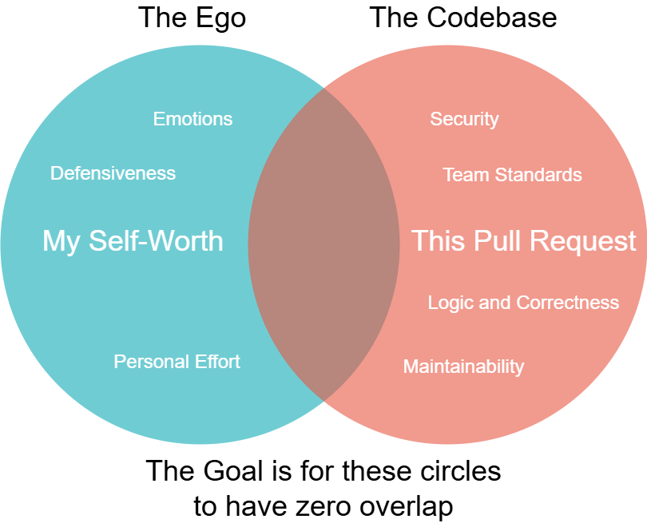
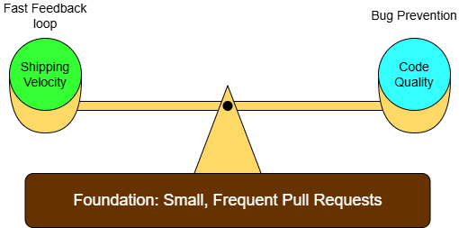
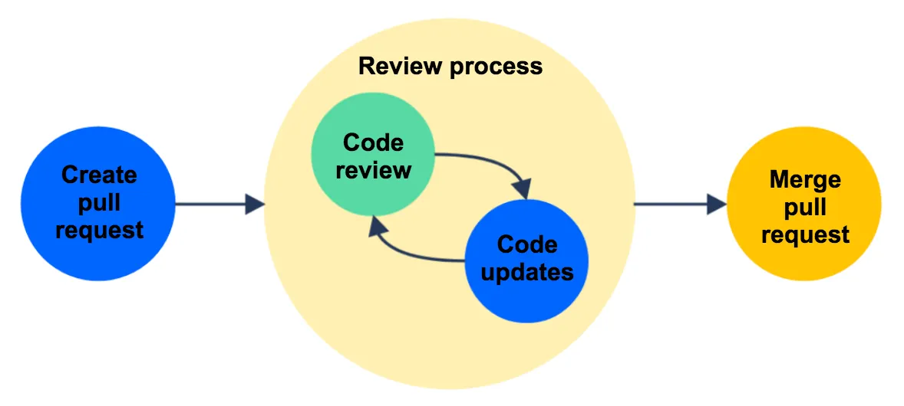

# Guide to Code Reviews

### Contributors: Liam Wiktorski & Adam Jennings

## Introduction

Code reviews are one of the easiest ways to improve code quality over time. They help catch bugs, make projects easier to maintain, and give teams a shared standard for what “good code” actually looks like. At the same time, they can also be one of the most frustrating parts of development if handled badly. A good review process should improve the code without turning every pull request into an argument.

## 1. The Mindset: You Are Not Your Code

One of the biggest problems in code reviews is how easy it is to take comments personally. After spending hours solving a problem, even a small suggestion can feel more critical than it really is. That's usually where tension starts. A reviewer may only mean that a function is unclear, but the person receiving the comment can hear it as a judgment on their ability.

The better way to look at it is that the pull request is not a reflection of your worth as a developer. It is just work being improved before it gets merged. In practice, this means not rushing to defend every decision and not treating a long list of comments like proof that you failed. Strong developers still get plenty of feedback. What matters more is how they respond to it. Someone who explains their reasoning, makes changes where needed, and stays open to discussion usually gets much more out of the process than someone who becomes defensive.

## 2. The Reviewer’s Role: Helpful Beats Harsh

Reviewing code well is more difficult than it looks. It is not enough to notice problems. You also have to point them out in a way that is useful. That is where a lot of reviews go wrong. A vague comment like “Why did you do this?” might seem quick and harmless, but it can come across as accusatory. The same is true when someone focuses too heavily on small preferences that do not really affect code quality.

A stronger review is specific and fair. Instead of just saying something should be changed, it helps to explain what issue it might cause or why another option would be easier to maintain. Tone matters here as much as technical accuracy. A reviewer does not need to sound overly soft, but they should sound like they are trying to improve the code, not win a point. It also helps when teams remove unnecessary debate by standardizing the small stuff through linters or style guides. That way, the discussion can stay focused on logic, readability, and long-term maintainability instead of personal taste.

## 3. Keeping Reviews Practical

Even a well-intentioned review process becomes a problem if it is too slow. A pull request that sits untouched for days usually loses momentum, and by the time someone reviews it properly, the author has already moved on mentally. On the other hand, reviewing too quickly can be just as bad if it turns into a rubber stamp where nobody actually checks the logic.

The best balance usually comes from keeping reviews small and moving them quickly. Smaller pull requests are easier to understand, easier to comment on, and less likely to overwhelm the reviewer. They also reduce the chance of long back-and-forth cycles because problems are easier to spot early. A useful review is not necessarily the longest one. Sometimes the best review is simply a timely one that catches the important issues, leaves the minor ones as suggestions, and helps the work keep moving.

## 4. Tools vs. Face-To-Face

Code reviews are done through tools such as GitHub, which make the process easier for both the reviewer and the person whose code is being reviewed. Even with that convenience, there are times when it is better to step away from the tool and have a direct conversation about a pull request.

A standard code review usually involves a reviewer leaving comments, questions and requested changes on a pull request. The author will then address these comments, questions and push commits to address requests. The process then repeats if the reviewer does not find the changes adequate. This can leave a lot to be desired at times, as this can lead to long back-and-forths in the comments that increase the length of time it takes for code to get merged.

A good practice to avoid this is to reach out to the pull request poster before leaving comments to ask questions and raise concerns. This saves time by avoiding long comment chains. Long back-and-forths are not good for teams and the review process, and should be avoided as much as possible.

## 5. Substantive and Helpful Comments

Reviewers can be helpful to the author by providing code examples within comments.

Helping to lighten the workload of the author helps immensely when trying to get a piece of code merged. This becomes especially true when a request made by the code reviewer can be difficult and time consuming to implement. For example, if a request is made that significantly changes a class to fit an agreed upon standard set by the team, point the PR contributor to other classes in the codebase where this has been followed.

There may be small chunks of code in a PR where a reviewer might raise concerns. It would be meaningful for that reviewer to leave a small code snippet to get a developer started on addressing a request. This keeps PRs moving along in the code review process and decreases the time it takes to merge a PR.

## Conclusion

Code reviews work best when people treat them as collaboration instead of correction. The person submitting the code should be open to feedback, and the reviewer should be clear without being harsh. When both sides approach the process properly, reviews stop feeling like a formality or a fight and start doing what they are supposed to do: improving the code and helping the team work better together.

## Sources

-   [https://abseil.io/resources/swe-book/html/ch09.html](https://abseil.io/resources/swe-book/html/ch09.html)
-   [https://blog.pragmaticengineer.com/good-code-reviews-better-code-reviews/](https://blog.pragmaticengineer.com/good-code-reviews-better-code-reviews/)
-   [https://stackoverflow.blog/2019/08/07/what-every-developer-should-learn-early-on/](https://stackoverflow.blog/2019/08/07/what-every-developer-should-learn-early-on/)
-   [https://stackoverflow.blog/2019/09/30/how-to-make-good-code-reviews-better/](https://stackoverflow.blog/2019/09/30/how-to-make-good-code-reviews-better/)
-   [https://mtlynch.io/human-code-reviews-1/](https://mtlynch.io/human-code-reviews-1/)