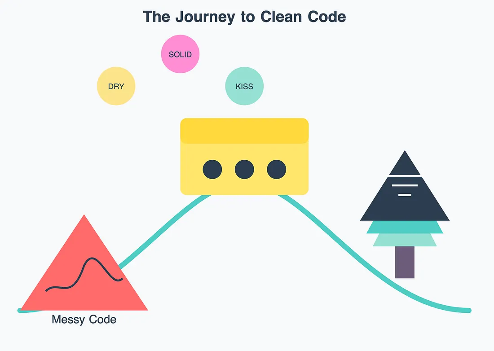
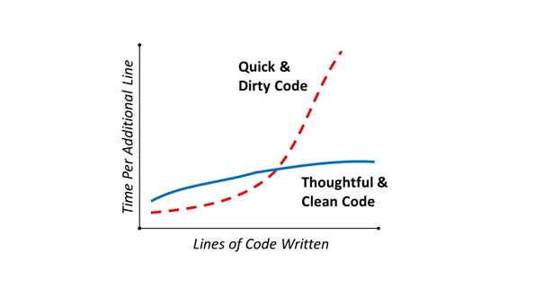
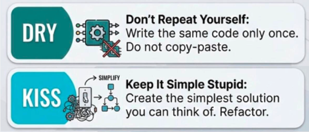
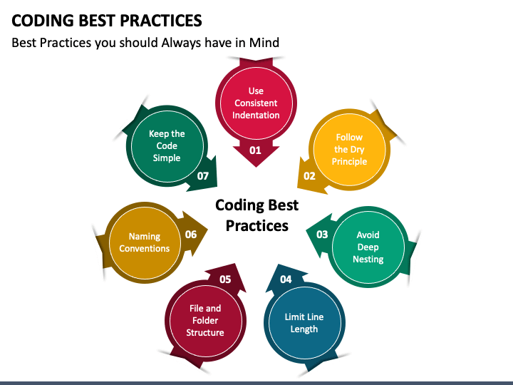

# Code Styling
### Contributors: Hamzah Naveid & Liam Wiktorski

## Introduction
Forming a set of coding standards for the organisation to use as a guideline is one of the most cost-effective methods to ensure quality and maintainability of code within a codebase.

A good, effective set of standards doesn't force the developer to conform to numerous rigid rules regarding the way that code should be styled - **it is more involved with guiding developers toward writing cleaner code through "best practices"** that will save plenty of headaches, both for themselves and for members of their team. 

The simple act of keeping these best practices in mind while writing code makes it easer to read, understand, and contribute to the code.

## 1. What Exactly Is Clean Code?
Clean code refers to code that is easy to read, understand, and maintain. 

The term is used to encompass a set of principles and best practices for writing code, such as:

* ### Using meaningful names
* ### Clear comments
* ### Consistent formatting
* ### DRY and KISS principles

Ultimately, the goal of clean code is to create software that is not only functional but also readable, maintainable, and efficient throughout its lifecycle.

## 2. Why Is Clean Code Important?
There are several reasons why keeping code clean is important:

### Readability and Maintenance
Writing readable code reduces the time required to grasp the code's functionality, leading to faster development times.

### Team Collaboration
Clear and consistent code facilitates communication and cooperation among team members, enabling understanding of each other's work and more effective collaboration.

### Debugging and Issue Resolution 
Clear structure, meaningful variable names, and well-defined functions make it easier for developers to identify and resolve issues, saving time and reducing headaches.

### Improved Quality and Reliability 
Well-structured code reduces the risk of introducing errors, leading to higher-quality and more reliable software down the line.

Clean code principles set the guidelines that enable teams to create more efficient code that’s easier to read, maintain, and extend. When code quality is high, every developer in the team, even ones who have just joined, should be able to easily understand any part of the code and work on it independently.

## 3. Principles and Best Practices
There are several principles and best practices to keep in mind when aiming to write code that is clean and less prone to causing headaches down the line.

### Principles

#### DRY (Don't Repeat Yourself)
Avoid writing the same code more than once. Instead, reuse code using functions, classes, modules, libraries, or other abstractions. 

This produces code that is more efficient, consistent, and maintainable. It also reduces the risk of errors and bugs, as the code only needs to be modified in just one place to update it.

#### KISS (Keep It Stupid Simple)
Prioritize straightforward solutions over complex ones. Avoid unnecessary complexity by eliminating duplicated code and removing unused features.

By keeping code simple - comprehensibility, usability, and maintainability become characteristics of the codebase.

### Best Practices      

#### Use Consistent Indentation
Keep indentation (2 or 4 spaces) consistent in each file to improve readability.

#### Use Meaningful and Descriptive Names
Choose names for variables, functions, and classes that reflect their purpose and behavior. 

This makes the code self-documenting and easier to understand without the need for extensive comments.

#### Avoid Hard-Coded Numbers
Use named constants instead of hard-coded values. Write constants with meaningful names that convey their purpose. 

This improves clarity and makes it easier to modify the code.

#### Avoid Deep Nesting
Keep nested code to a minimum by opting to encapsulate conditional statements or loops into their own functions. 

Encapsulating such logic into a function with a descriptive name clarifies its purpose and simplifies code comprehension.

#### Use Comments Sparingly
There is no need to comment on obvious things - the code is able to explain itself. Excessive or unclear comments can clutter the codebase and become outdated, leading to confusion and a messy codebase. 

Instead, use comments to convey the "why" behind specific actions or explain behaviors.

#### Limit Line Length
Keep the length of lines under 120 characters to improve readability.

## Conclusion

## Sources
* https://medium.com/@SoftwareEngineering/mastering-clean-code-and-coding-standards-5d436e3ff32c

* https://blog.codacy.com/what-is-clean-code

* https://medium.com/@curiousraj/the-principles-of-clean-code-dry-kiss-and-yagni-f973aa95fc4d